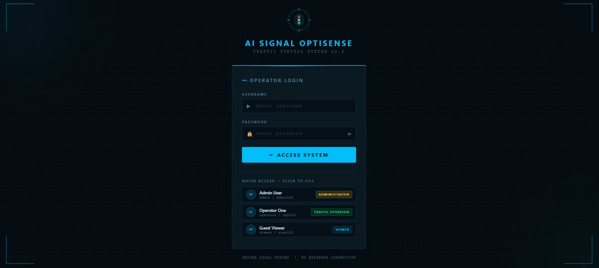
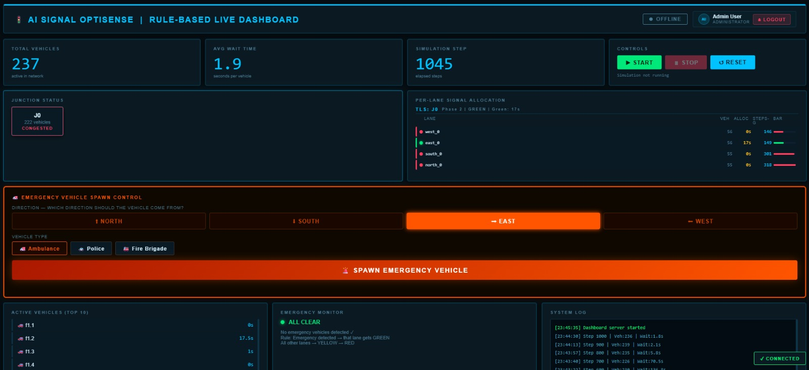
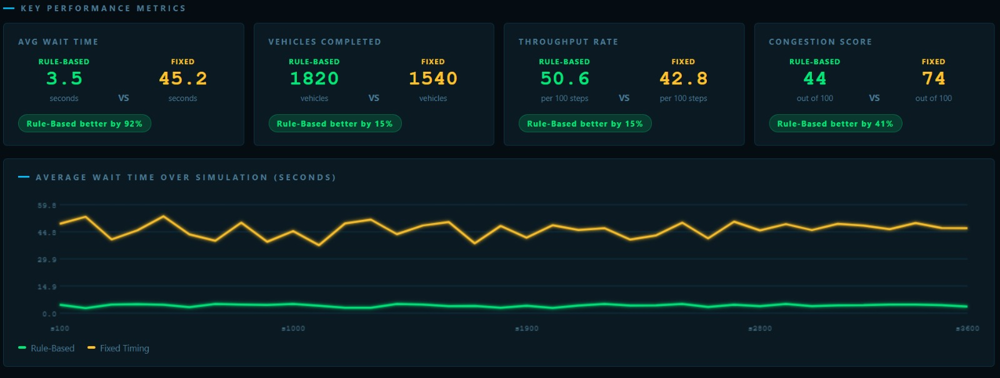

<div align="center">

# 🚦 AI Signal OptiSense

### AI-Based Smart Traffic Signal Control System

**Dynamic Traffic Signal Optimization using Artificial Intelligence, Python, SUMO & TraCI**


</div>

---

# 📌 Overview

AI Signal OptiSense is an AI-powered Smart Traffic Management System developed as a Final Year B.Tech Computer Science Engineering Group Project.

The system dynamically adjusts traffic signal timings based on real-time traffic density and provides immediate priority to emergency vehicles such as ambulances, police vehicles, and fire brigades. Using **SUMO** and **TraCI**, the project simulates intelligent traffic flow to reduce congestion, minimize waiting time, and improve overall road efficiency.

---

# ✨ Key Features

- 🚦 Dynamic Traffic Signal Optimization
- 🚑 Emergency Vehicle Priority System
- 🚗 Real-Time Vehicle Monitoring
- 📊 Interactive Web Dashboard
- 📈 Rule-Based vs Fixed Signal Performance Comparison
- 📉 Traffic Density Analysis
- ⚡ Automatic Signal Timing Adjustment
- 📁 JSON-Based Metrics Generation
- 🌐 SUMO Traffic Simulation Integration

---

# 🛠 Tech Stack

| Category | Technologies |
|-----------|-------------|
| Programming Language | Python |
| Traffic Simulator | SUMO |
| Communication | TraCI |
| Frontend | HTML5, CSS3, JavaScript |
| Data Storage | JSON |
| Version Control | Git & GitHub |
| IDE | Visual Studio Code |

---

# 🏗️ System Architecture

```text
                 +----------------------+
                 |   SUMO Simulation    |
                 +----------+-----------+
                            |
                            |
                     Traffic Data
                            |
                            ▼
               +------------------------+
               | Python + TraCI Engine  |
               +-----------+------------+
                           |
        +------------------+------------------+
        |                                     |
        ▼                                     ▼
 Emergency Vehicle                  Density Detection
 Detection                           & Signal Logic
        |                                     |
        +------------------+------------------+
                           |
                           ▼
                 Signal Controller
                           |
                           ▼
              Real-Time Dashboard (HTML)
                           |
                           ▼
                  Performance Metrics
```

---

# 🔄 Workflow

```text
Start
   │
   ▼
Load SUMO Network
   │
   ▼
Spawn Vehicles
   │
   ▼
Collect Traffic Density
   │
   ▼
Emergency Vehicle?
   │
 ┌─Yes───────────────┐
 │                   │
 ▼                   ▼
Give Priority      Normal Signal Logic
 │                   │
 └──────────┬────────┘
            ▼
Update Dashboard
            │
            ▼
Generate Metrics
            │
            ▼
End
```

---

# 📸 Project Screenshots

## 🔐 Login Page



---

## 📊 Live Dashboard



---

## 🚗 SUMO Traffic Simulation


---

## 📈 Rule-Based vs Fixed-Time Comparison


---

## 📊 Performance Metrics



---

# 📊 Performance Results

| Performance Metric | Rule-Based System | Fixed-Time System |
|--------------------|-----------------:|------------------:|
| Average Waiting Time | **3.5 sec** | **45.2 sec** |
| Vehicle Throughput | **50.6 Vehicles** | **42.8 Vehicles** |
| Congestion Score | **44** | **74** |

✅ The AI-based traffic signal controller significantly reduced waiting time and congestion while improving traffic throughput.

---

# 🚀 Installation

Clone the repository

```bash
git clone https://github.com/Saritaparte/AI_Siganal_Optisence.git
```

Go to the project folder

```bash
cd AI_Siganal_Optisence
```

Install dependencies

```bash
pip install -r requirements.txt
```

Run the project

```bash
python run_system.py
```

---

# 📂 Project Structure

```text
AI_Siganal_Optisence
│
├── dashboard/
├── sumo/
├── screenshots/
├── docs/
├── run_system.py
├── dashboard_server.py
├── rule_based_tls.py
├── requirements.txt
├── README.md
└── LICENSE
```

---

# 👥 Project Team

This project was developed as a **Final Year B.Tech Computer Science Engineering Group Project**.

| Team Member | Contribution |
|-------------|--------------|
| **Sarita Parte** | Python Development, Dashboard Integration & Project Coordination |
| **Chetan Patil** | SUMO Network Design & Traffic Simulation |
| **Sanika Suryavanshi** | Frontend Development (HTML, CSS & JavaScript) |
| **Harshada Sawant** | Testing, Documentation & Performance Evaluation |
| **Priya More** | Research, Analysis & Project Validation |

---

# 👨‍💻 Developed By

**AI Signal OptiSense Project Team**

Department of Computer Science & Engineering

Academic Year: **2025–2026**

---

## 📜 License

This project is licensed under the **MIT License**.

© 2026 AI Signal OptiSense Project Team

---

## ⭐ Support

If you found this project useful, please consider giving this repository a ⭐ on GitHub.

---

<div align="center">

### 🚦 Smart Traffic Today, Safer Roads Tomorrow 🚦

</div>
